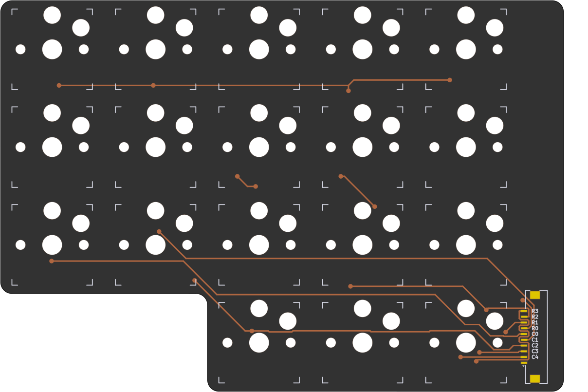
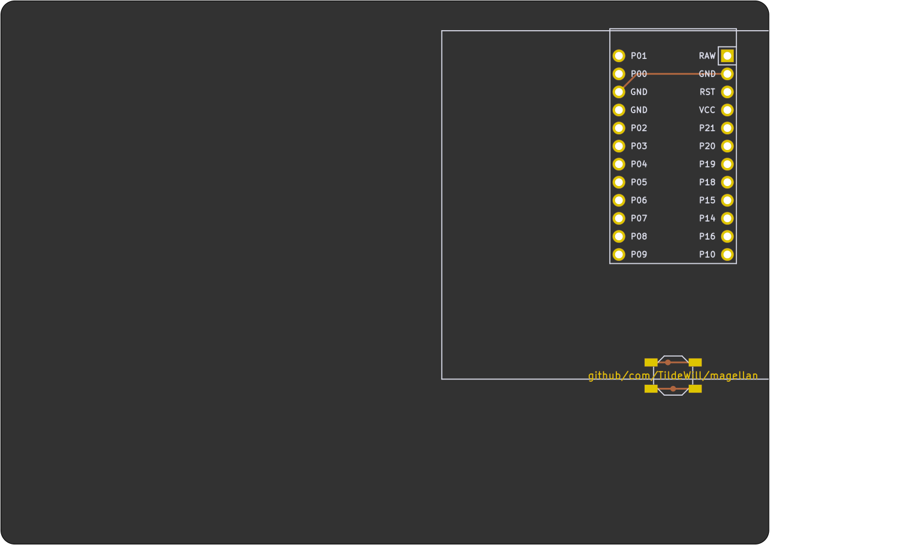
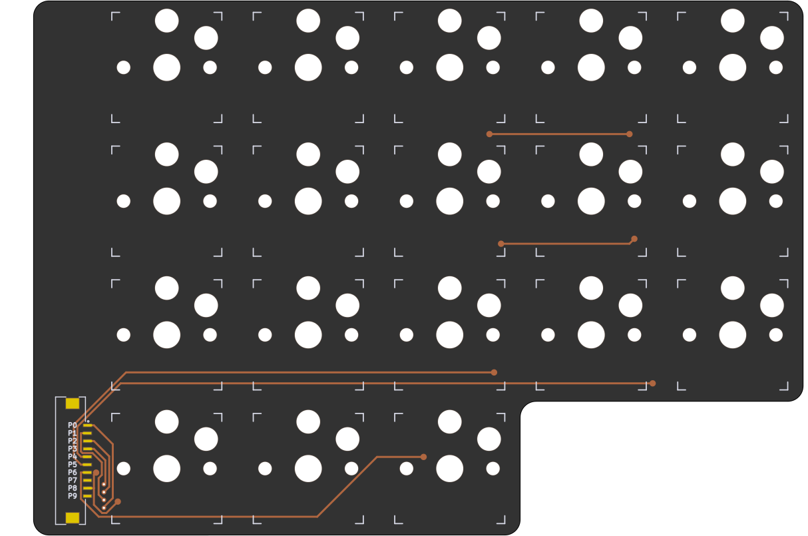
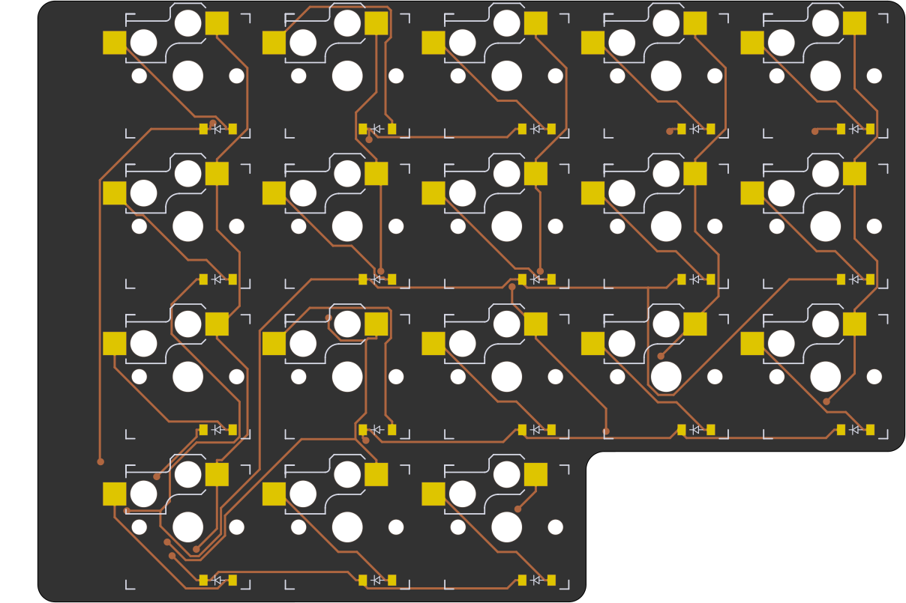
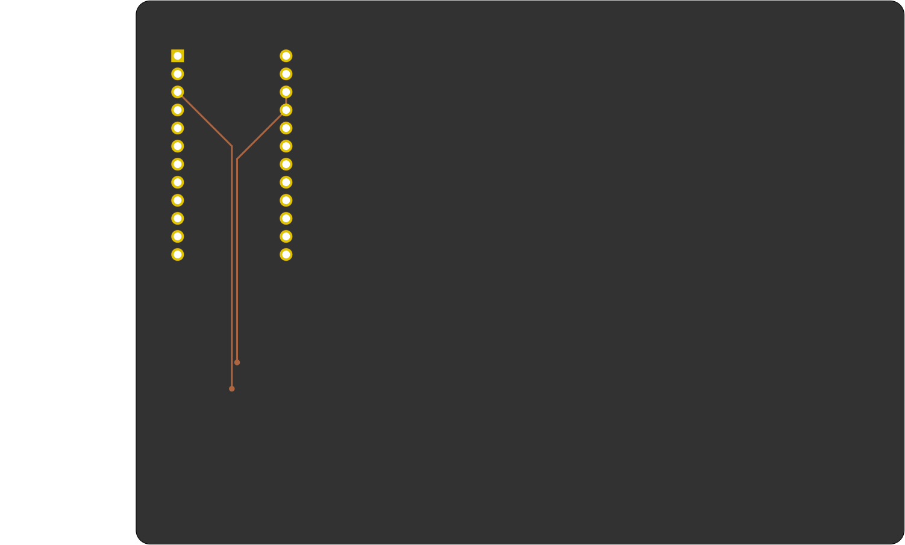
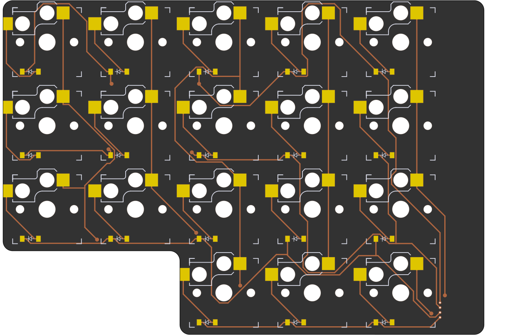

# Magellan Custom Mechanical Keyboard
## Designed for travel

## Layout
The Magellan keeb is a monoblock, split, wired, ortholinear custom keyboard with an Azoteq TPS65 trackpad. The physical layout is inspired by the [ChocV by BrickBots](https://github.com/brickbots/chocV), which is compact and I love. The keymap similarly uses Miryoku. 

Since this was my first time designing a keeb, I wanted to be able to iterate quickly without having to repeat a lot of manual steps. So I have built my work on top of [Soundmonster's samoklava repo](https://github.com/soundmonster/samoklava), and some further innovations found in [tbaumann's typematrix_split_ergogen fork](https://github.com/tbaumann/typematrix_split_ergogen). These repos use Ergogen, a declarative design tool, so making a change is pain free. The process looks like this:

* Layout is declared by me using [Ergogen](https://github.com/mrzealot/ergogen/)'s syntax.
* The build system runs Ergogen to translate YAML to a KiCad PCB and plate files for FR-4 fab or laser cutting
* The build system then uses [kicad-automation-scripts](https://github.com/productize/kicad-automation-scripts) and [FreeRouting](https://github.com/freerouting/freerouting) to **automatically route the traces on the PCB**
* Lastly, the build system uses [KiKit](https://github.com/yaqwsx/KiKit) to render PCB previews (see pictures below) and production-ready **Gerber files**

### Front

### Back

## Features and Design Considerations

* ChocV inspired physical key layout
* Kailh Choc low profile switches
* Integrated multi-touch Azoteq TPS65 trackpad
* Wired because...
  * if you're traveling, you need a cord anyway 
  * QMK supports the trackpad well, but not wireless
  * ZMK supports wireless well, but not trackpads, so I optimized for the trackpad.
* ProMicro controller
* Accessible reset button
* Mono-block for easy transport

### Scrapped Ideas

* Include a mic and speaker
  * scrapped because key noise would be too loud for mic
* Include a projector
  * small projectors still suck in daylight
* Split keyboard
  * I hate the TRRS cable on my desk, feels like wasted space, and wireless isn't an option (see above)
  * I couldn't figure how to have the trackpad and keep the halves equal; the [Eskarp](https://kbd.news/Eskarp-1867.html) is essentially what you'd get.
  

## How to

If you would like to modify this:
* fork it
* change `input/config.yaml` to your liking
* push your changes; the `build.yml` GitHub Workflow will pick it up, autoroute and generate Gerbers, all in a zip file.
  See https://github.com/soundmonster/samoklava/actions
* or:
  * make sure to have Docker CLI and NodeJS installed (see [.tool-versions](.tool-versions) for node version)
  * run `make setup clean all`
  * check the `output` folder for KiCad PCBs and Gerbers

See the [workflow](.github/workflows/build.yml) or the [Makefile](Makefile) for more details.

### Disclaimer

Based on the work of Soundmonster https://github.com/soundmonster/samoklava/ where they say:
> This is an early experimental prototype. Please do not rely on the autogenerated files and double check them manually before sending them off to a PCB fab. The author and other random strangers on the internet have been able to produce working keyboard prototypes from this repo; this does not mean that everything will work every time.

