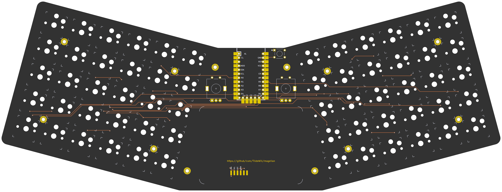
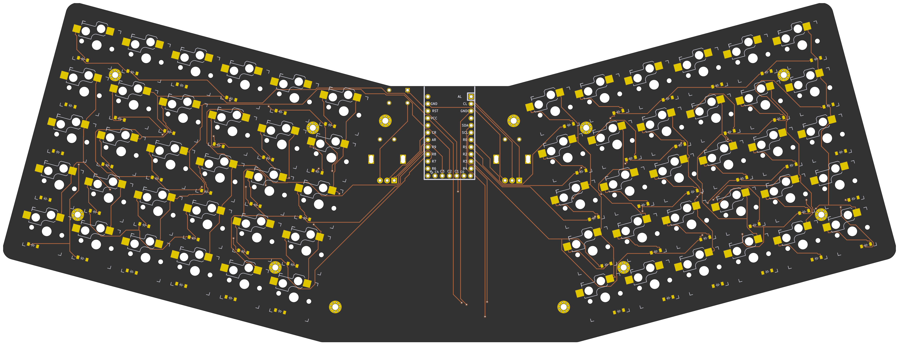

# Magellan Custom Mechanical Keyboard
## Designed for travel

## Layout
The Magellan keeb is a monoblock, split, wired, ortholinear custom keyboard with an Azoteq TPS65 trackpad. The physical layout is inspired by the [ChocV by BrickBots](https://github.com/brickbots/chocV), which is compact and I love. The keymap similarly uses Miryoku. 

Since this was my first time designing a keeb, I wanted to be able to iterate quickly without having to repeat a lot of manual steps. So I have built my work on top of [Soundmonster's samoklava repo](https://github.com/soundmonster/samoklava), and some further innovations found in [tbaumann's typematrix_split_ergogen fork](https://github.com/tbaumann/typematrix_split_ergogen). These repos use Ergogen coupled with FreeRouting and kicad-automation-scripts. The images are then rendered using kitkit. 

### Front
 
### Back

The interesting thing about this keyboard is that it's a declarative design:
* Layout is declared using [Ergogen](https://github.com/mrzealot/ergogen/). 
* The build system uses Ergogen to translate YAML to a KiCad PCB and plate files for FR-4 fab or laser cutting
* uses [kicad-automation-scripts](https://github.com/productize/kicad-automation-scripts) and [FreeRouting](https://github.com/freerouting/freerouting) to **automatically route the traces on the PCB**
* uses [KiKit](https://github.com/yaqwsx/KiKit) to render PCB previews (see above pictures) and production-ready **Gerber files**

## Features

* ChocV inspired physical key layout
* Kailh Choc switches, low profile key switches
* integrated multi-touch Azoteq TPS65 trackpad 
  

## How to

If you would like to modify this:
* fork it
* change `input/config.yaml` to your liking
* push your changes; the `build.yml` GitHub Workflow will pick it up, autoroute and generate Gerbers, all in a zip file.
  See https://github.com/soundmonster/samoklava/actions
* or:
  * make sure to have Docker CLI and NodeJS installed (see [.tool-versions](.tool-versions) for node version)
  * run `make setup clean all`
  * check the `output` folder for KiCad PCBs and Gerbers

See the [workflow](.github/workflows/build.yml) or the [Makefile](Makefile) for more details.

## Disclaimer

Based on the work of Soundmonster https://github.com/soundmonster/samoklava/

Requires ergogen 4.x

